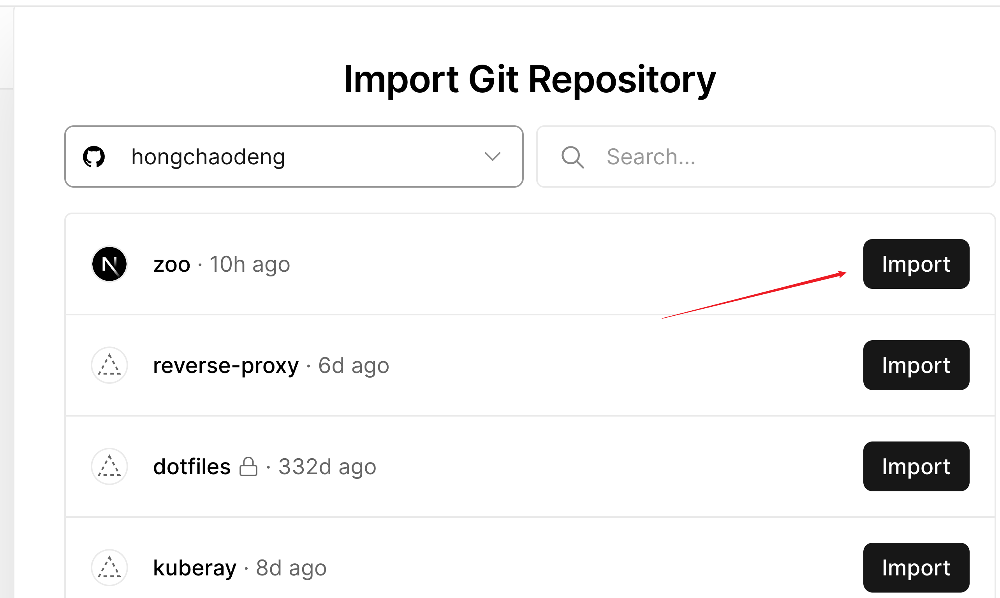
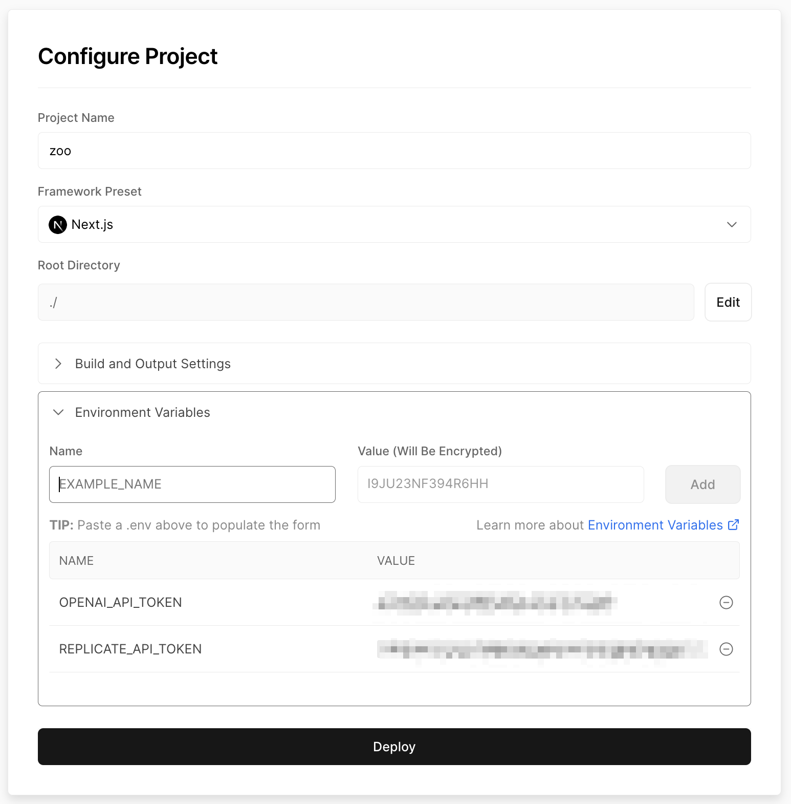
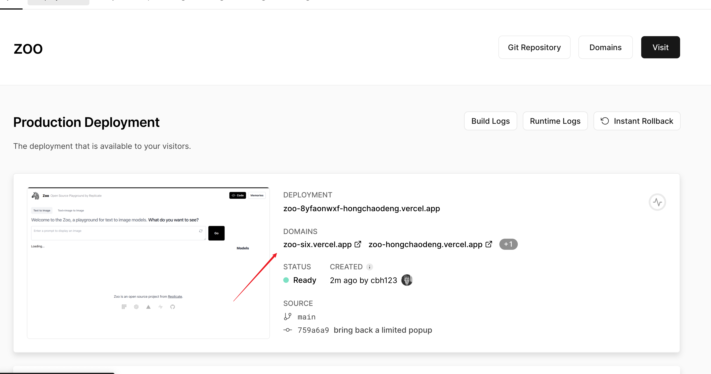
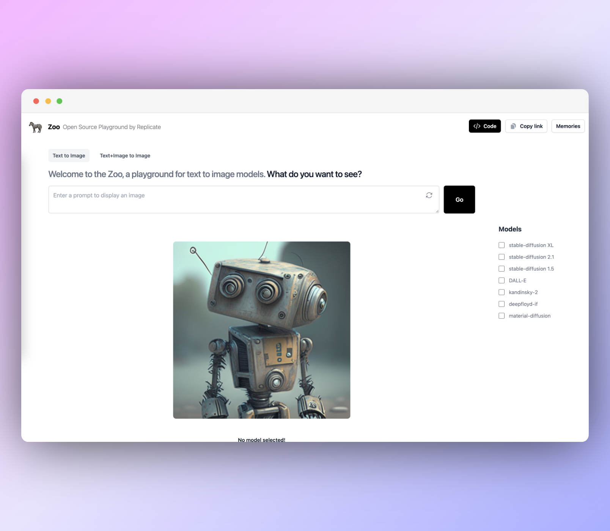
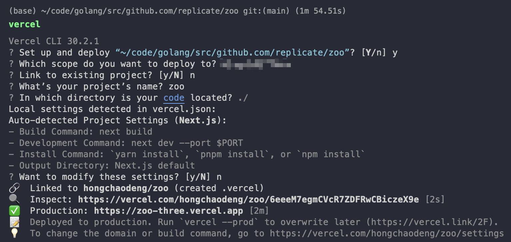

# Deploying Zoo on Vercel

This doc will walk you through deploying Zoo on Vercel.

## Using the Vercel UI

1. Fork this repo
1. Create a new project on [Vercel](https://vercel.com/)
    

1. Connect your forked repo to your new project
    

1. Configure your environment variables
    

1. Deploy! This will take a few minutes. But once it's done, you'll have a URL where you can access your app.
    

1. Click on it to see your app!
    

## Using the Vercel CLI


1. Install the Vercel CLI by running the following command in your terminal:

    ```console
    npm install -g vercel
    ```

1. Navigate to the root directory of your Zoo project using the terminal.
   
2. copy the `.env.example` file, name it `.env`, and fill in your credentials.

3. (Optional) Login to your Vercel account by running:
    
    ```console
    vercel login
    ```
4. Initialize the project by running:

    ```console
    vercel init
    ```

    Select `next-js` as the framework and `y` when asked to override the default settings.

5. Once the initialization is complete, you can deploy the project to Vercel by running:

    ```console
    vercel
    ```

    This command will start the deployment process, and Vercel will provide you with a unique URL where your app will be accessible once deployed.

6. Wait for the deployment to finish. It may take a few minutes, but once it's done, Vercel will display the URL of your deployed app in the terminal.

    